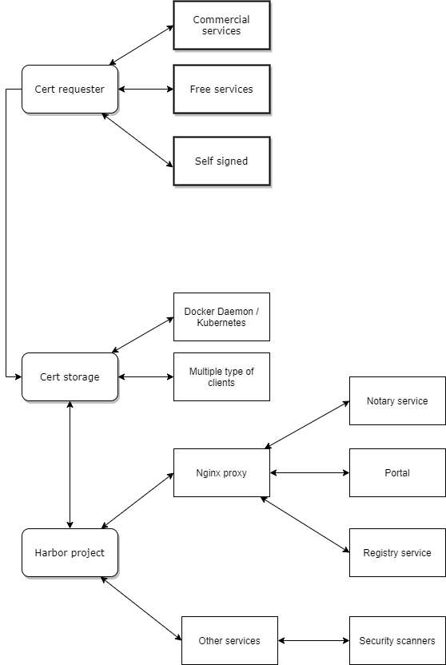
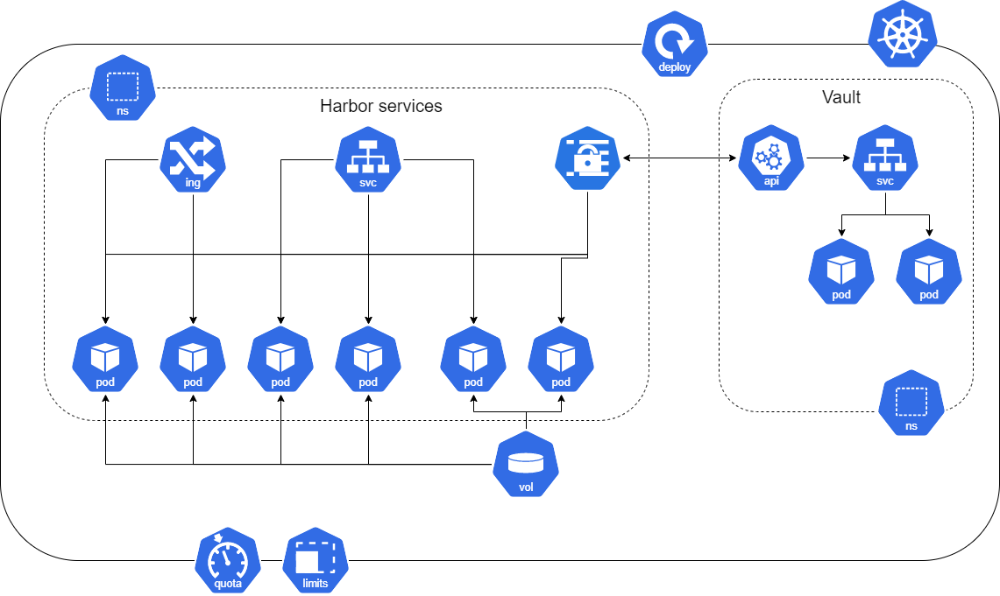

>Some of these date back to older versions but efforts are made to keep the most important - sometimes :)

# Docker Registry implementation design document 
# Goals
Provide Docker container registry as a LambdaStack service. Registry  for application containers storage, docker image signs and docker image security scanning. 
# Use cases
Store application docker images in private registry.
Sign docker images with passphrase to be trusted.
Automated security scanning of docker images which are pushed to the registry.

# Architectural decision

## Comparison of the available solutions

Considered options:

 - Harbor [https://github.com/goharbor/](https://github.com/goharbor/)
 - Quay [https://github.com/quay/](https://github.com/quay/)
 - Portus [https://github.com/SUSE/Portus](https://github.com/SUSE/Portus)

Feature comparison table 

|Feature  | Harbor | Quay.io | Portus	
|--|--|--|--|
|Ability to Determine Version of Binaries in Container  |Yes |Yes |Yes |
|Audit Logs | Yes | Yes | Yes |
|Content Trust and Validation|Yes | Yes | Yes |
|Custom TLS Certificates|Yes|Yes|Yes|
|Helm Chart Repository Manager|Yes|Partial|Yes|
|Open source|Yes|Partial|Yes|
|Project Quotas (by image count & storage consumption)|Yes|No|No|
|Replication between instances|Yes|Yes|Yes|
|Replication between non-instances|Yes|Yes|No|
|Robot Accounts for Helm Charts|Yes|No|Yes|
|Robot Accounts for Images|Yes|Yes|Yes|
|Tag Retention Policy|Yes|Partial|No|
|Vulnerability Scanning & Monitoring|Yes|Yes|Yes|
|Vulnerability Scanning Plugin Framework|Yes|Yes|No|
|Vulnerability Whitelisting|Yes|No|No|
|Complexity of the installation process|Easy|Difficult|Difficult|
|Complexity of the upgrade process|Medium|Difficult|Difficult|

Source of comparison: [https://goharbor.io/docs/1.10/build-customize-contribute/registry-landscape/](https://goharbor.io/docs/1.10/build-customize-contribute/registry-landscape/)
and also based on own experience (stack installation and upgrade).

# Design proposal

## Harbor services architecture 

## Implementation architecture
Additional components are required for Harbor implementation.  

- Shared storage volume between kubernetes nodes (in example NFS),
- Component for TLS/SSL certificate request (maybe cert-manager?), 
- Component for TLS/SSL certificate store and manage certificate validation (maybe Vault?), 
- Component for TLS/SSL certificate share between server and client (maybe Vault?). 
- HELM component for deployment procedure.

Diagram for TLS certificate management:

Kubernetes deployment diagram:

## Implementation steps
- Deploy shared storage service (in example NFS) for K8s cluster (M/L)
- Deploy Helm3 package manager and also Helm Charts for offline installation (S/M)
- Deploy Hashicorp Vault for self-signed PKI for Harbor (external task + S for Harbor configuration)
- Deploy "cert request/management" service and integrate with Hashicorp Vault - require research (M/L)
- Deploy Harbor services using Helm3 with self-signed TLS certs (for non-production environments) (L)
- Deploy Harbor services using Helm3 with commercial TLS certs (for prod environments) (M/L)

