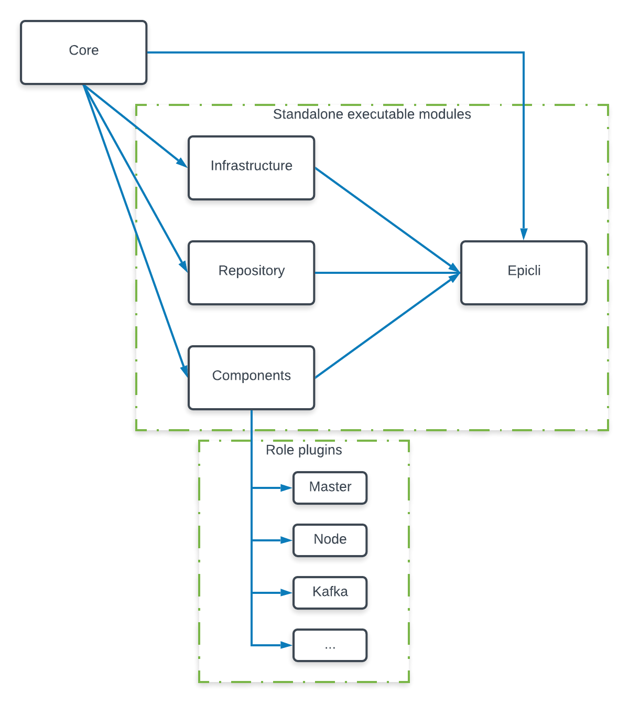

# LambdaStack modular design document

Affected version: 0.4.x

## Goals

Make lambdastack easier to work on with multiple teams and make it easier to maintain/extend by:

1. Splitting up the monotithic LambdaStack into seperate modules which can run as standalone CLI tools or be linked together through LambdaStack.
2. Create an extendable plug and play system for roles which can be assigned to components based on certain tasks: apply, upgrade, backup, restore, test etc

## Architectural design

The current monolithic lambdastack will be split up into the following modules.



### Core

Shared code between other modules and not executable as standalone. Responsible for:

- Config
- Logging
- Helpers
- Data schema handling: Loading, defaults, validating etv.
- Build output handling: Loading, saving, updating etc.
- Ansible runner

### Infrastructure

Module for creating/destroying cloud infrastructure on AWS/Azure/Google... + "Analysing" existing infrastructure. Maybe at a later time we want to split up the different cloud providers into plugins as well.

Functionality (rough outline and subjected to change):

1. template:
    ```
    "lambdastack infra template -f outfile.yaml -p awz/azure/google/any (--all)"
    "infra template -f outfile.yaml -p awz/azure/google/any (--all)"?
    "Infrastructure.template(...)"
    Task: Generate a template yaml with lambdastack-cluster definition + possible infra docs when --all is defined
    Input:  File to output data, provider and possible all flag
    Output: outfile.yaml template
    ```
2. apply:
    ```
    "lambdastack infra apply -f data.yaml"
    "infra apply -f data.yaml"?
    "Infrastructure.apply(...)"
    Task: Create/Update infrastucture on AWS/Azure/Google...
    Input:  Yaml with at least lambdastack-cluster + possible infra docs
    Output: manifest, ansible inventory and terrafrom files
    ```
3. analyse:
    ```
    "lambdastack infra analyse -f data.yaml"
    "infra analyse -f data.yaml"?
    "Infrastructure.analyse(...)"
    Task: Analysing existing infrastructure
    Input:  Yaml with at least lambdastack-cluster + possible infra docs
    Output: manifest, ansible inventory
    ```
4. destroy:
    ```
    "lambdastack infra destroy -b /buildfolder/"
    "infra destroy -b /buildfolder/"?
    "Infrastructure.destroy(...)"
    Task:  Destroy all infrastucture on AWS/Azure/Google?
    Input:  Build folder with manifest and terrafrom files
    Output: Deletes the build folder.
    ```

### Repository

Module for creating and tearing down a repo + preparing requirements for offline installation.

Functionality (rough outline and subjected to change):

1. template:
    ```
    "lambdastack repo template -f outfile.yaml  (--all)"
    "repo template -f outfile.yaml (--all)"?
    "Repository.template(...)"
    Task: Generate a template yaml for a repository
    Input:  File to output data, provider and possible all flag
    Output: outfile.yaml template
    ```
2. prepare:
    ```
    "lambdastack repo prepare -os (ubuntu-1904/redhat-7/centos-7)"
    "repo prepare -o /outputdirectory/"?
    "Repo.prepare(...)"
    Task: Create the scripts for downloading requirements for a repo for offline installation for a certain OS.
    Input:  Os which we want to output the scripts for:  (ubuntu-1904/redhat-7/centos-7)
    Output: Outputs the scripts  scripts
    ```
3. create:
    ```
    "lambdastack repo create -b /buildfolder/ (--offline /foldertodownloadedrequirements)"
    "repo create -b /buildfolder/"?
    "Repo.create(...)"
    Task: Create the repository on a machine (either by running requirement script or copying already prepared ) and sets up the other VMs/machines to point to said repo machine. (Offline and offline depending on --offline flag)
    Input:  Build folder with manifest and ansible inventory and posible offline requirements folder for onprem installation.
    Output: repository manifest or something only with the location of the repo?
    ```
4. teardown:
    ```
    "lambdastack repo teardown -b /buildfolder/"
    "repo teardown -b /buildfolder/"?
    "Repo.teardown(...)"
    Task: Disable the repository and resets the other VMs/machines to their previous state.
    Input:  Build folder with manifest and ansible inventory
    Output: -
    ```

### Components

Module for applying a command on a component which can contain one or multiple roles. It will take the Ansible inventory to determine which roles should be applied to which component. The command each role can implement are (rough outline and subjected to change):

- apply: Command to install roles for components
- backup: Command to backup roles for components
- restore: Command to backup roles for components
- upgrade: Command to upgrade roles for components
- test: Command to upgrade roles for components

The `apply` command should be implemented for every role but the rest is optional. From an implementation perspective each role will be just a seperate folder inside the plugins directory inside the `components` module folder with command folders which will contain the ansible tasks:

```
components-|
           |-plugins-|
                     |-master-|
                     |        |-apply
                     |        |-backup
                     |        |-restore
                     |        |-upgrade
                     |        |-test
                     |
                     |-node-|
                     |      |-apply
                     |      |-backup
                     |      |-restore
                     |      |-upgrade
                     |      |-test
                     |
                     |-kafka-|
                     |       |-apply
                     |       |-upgrade
                     |       |-test
```

Based on the Ansible inventory and the command we can easily select which roles to apply to which components. For the commands we probably also want to introduce some extra flags to only execute commands for certain components.

Finally we want to add support for an external plugin directory where teams can specify there own role plguins which are not (yet) available inside LambdaStack itself. A feature that can also be used by other teams to more easily start contributing developing new components.

### LambdaStack

Bundles all executable modules (Infrastructure, Repository, Component) and adds functions to chain them together:

Functionality (rough outline and subjected to change):

1. template:
    ```
    "lambdastack template -f outfile.yaml -p awz/azure/google/any (--all)"
    "LambdaStack.template(...)"
    Task: Generate a template yaml with lambdastack-cluster definition + possible infrastrucure, repo and component configurations
    Input:  File to output data, provider and possible all flag
    Output: outfile.yaml with templates
    ```
2. apply:
    ```
    "lambdastack apply -f input.yaml"
    "LambdaStack.template(...)"
    Task: Sets up a cluster from start to finish
    Input:  File to output data, provider and possible all flag
    Output: Build folder with manifest, ansible inventory, terrafrom files, component setup.
    ```

...
