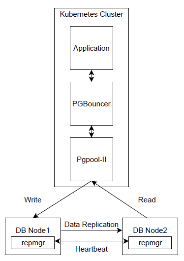

>Some of these date back to older versions but efforts are made to keep the most important - sometimes :)

# LambdaStack database connection design document

Affected version: 0.5.x

## 1. Introduction

Deploying PostgreSQL in a high-demand environment requires reliability and scalability. Even if you don't scale your infrastructure and you work only on one database node at some time you will reach connection limit. Number of connection to Postgres database is limited and is defined by `max_connection` parameter. It's possible to extend this limit, but you shouldn't do that reckless - this depends of machine resources.

## 2. Use case

LambdaStack delivers solution to build master - slave database nodes configuration. This means that application by default connects to master database. Database replica is updated immediately when master is modified.

## 3. Assumptions

- Database replica is read only
- Write data only to Control Plane Node
- Select operations on replica
- There is no Pgpool-II software available for Ubuntu 18.04 - not officially supported

## 4. Design proposal

### 4.1. Minimal configuration

Minimal solution to meet with client requirements is to install Pgbouncer on database master node to maintain connection pool. This will partially solve problem with exceeded connection limits. All applications need to be reconfigure to connect not directly with database, but with Pgbouncer service which will redirect connection to database master.
This solution we can deliver fast and it's quite easy to implement.

### 4.2. High Availability configuration



Above chart presents high availability database cluster. Pgbouncer and Pgpool are located in separate pods in Kubernetes cluster. PGbouncer maintains connection pool and redirect them to pgpool which is responsible for connection pooling between master and slave node. This allows to redirect write operations to master database node and read (select) operations to slave database node(s). Additionally repmgr takes care of databases availability (must be installed on every database node), and promote subsequent slave node to be master when previous master went down.


# LambdaStack PostgreSQL auditing design document

Affected version: 0.5.x

## Goals

Provide functionality to perform auditing of operations performed on PostgreSQL.

## Use cases

For SOX and other regulations compliance platform should provide auditing function for PostgreSQL database.
This should be set via LambdaStack automation in LambdaStack configuration yaml.

## Example use

In configuration for PostgreSQL we can add additional parameters, that could configure additional properties of PostgreSQL.
Config similar to proposed below can be used to configure auditing with using pgaudit.

```yaml
kind: configuration/postgresql
title: PostgreSQL
name: default
specification:
  ...
  extensions:
    pgaudit:
      enabled: false
      shared_preload_libraries:
        - pgaudit
      config_file_parameters:
        pgaudit.log: 'all, -misc'
        log_connections: 'on'
        log_disconnections: 'on'
        log_line_prefix: "'%m [%p] %q%u@%d,host=%h '"
        log_statement: 'none'
  ...
```

## Design proposal

Add to PostgreSQL configuration additional settings, that would install and configure pgaudit extension.
For RHEL we use PostgreSQL installed from Software Collections repository, which doesn't provide pgaudit package for PostgreSQL
versions older than 12. For this reason, on RHEL pgaudit will be installed from PostgreSQL repository.
